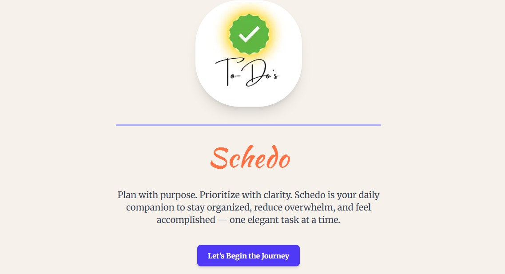

### Welcome to To-Do List Web Application ***[Schedo](https://to-do-list-frontend-plum.vercel.app/)***

## Table of contents

- [Project Description](#project-description)
- [Features](#features)
- [Technologies Used](#technologies-used)
- [ScreenShots](#screenshots)
- [Links](#links)
- [Installation](#installation)
- [Usage](#usage)
- [Future Enhancements](#future-enhancements)
- [Author](#author)
- [Contributing](#contributing)
- [Acknowledgments](#acknowledgments)
- [License](#license)
----

## Project Description

The To-Do List web application ***[Schedo](https://to-do-list-frontend-plum.vercel.app/)*** is a simple and efficient tool that allows users to manage their tasks effectively. Users can add, edit, delete, and mark tasks as completed to stay organized.

## Features

###  Core Functionalities
- Add, edit, and delete tasks.
- Mark tasks as complete/incomplete.
- Real-time updates with a clean UI.
- User authentication (Login / Signup).
- Persistent task storage using Supabase DB.

## Technologies Used

###  Frontend
- Built with **Next.js + React**.
- Responsive UI with **Tailwind CSS**.
- Interactive design with **Framer Motion**.
- Toast notifications with **react-hot-toast**.

###  Backend
- RESTful API using **Express.js**.
- Authentication using **JWT + bcrypt**.
- Cookie-based session management.
- Environment-based configuration.
- Supabase used as cloud-hosted PostgreSQL database.
---
##  Tech Stack

| Layer      | Technology                             |
|------------|-----------------------------------------|
| Frontend   | Next.js, React, Tailwind CSS, Axios     |
| Backend    | Node.js, Express.js, Supabase, JWT      |
| Auth       | bcryptjs, cookie-parser, jsonwebtoken   |
| UI/UX      | Lucide Icons, Framer Motion, Toasts     |
| Hosting    | Frontend: Vercel · Backend: Render      |

---

##  Screenshots

| Home Page | Login | DashBoard (with filtered and sorted Task Management) |
|------------|-------------------|-------------------|
|  |  |  |

---

## Links
Live site Url: [To-Do App](https://to-do-list-frontend-plum.vercel.app/)

---

##  Installation

### 1. Clone the Repository

```bash
git clone https://github.com/Saras171/Code_Alpha_To_Do_List.git
cd to-do-list
```
### 2. Setup Frontend
```bash
cd frontend
npm install
npm run dev
```
### 3. Setup Backend
```bash
cd backend
npm install
npm start
```

🔐 Make sure to configure .env files in both frontend/ and backend/ with appropriate variables like API keys, SUPABASE_URL, JWT_SECRET, etc.

 ### Environment Variables
#### Frontend .env
 ```bash
 NEXT_PUBLIC_API_URL=your_backend_Url/api
```
#### Backend .env
```bash
PORT=your_port
JWT_SECRET=your_jwt_secret
SUPABASE_URL=your_supabase_url
SUPABASE_KEY=your_supabase_anon_key
```
---
## Usage

- Open the application in your browser.

- Enter a task in the input field and press Add symbol "+".

- Click on a task to mark it as completed.

- Use the delete button to remove a task.
---
## Future Enhancements

- Notifications and reminders
---
## Author
- GitHub Repository: [To-Do App](https://github.com/Saras171/Code_Alpha_To_Do_List.git)
---
## Contributing

Contributions are welcome 🤝! Feel free to submit a pull request.

---

## Acknowledgments

I would like to sincerely thank 🙏 **Code Alpha** for providing me the opportunity through their internship program to work on this project. The guidance, structure, and learning environment offered by the team greatly contributed to enhancing my skills and building this To-Do List web application successfully.

---

## License 

This project is licensed under the [Apache License](/LICENSE).

